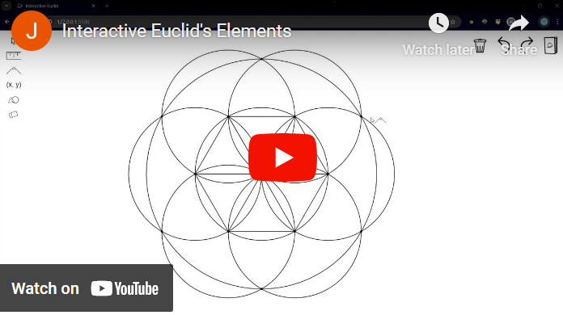

# Interactive Euclid's *Elements* Visualization

[Try it out](https://main.d3vk2bik4irmuo.amplifyapp.com/)

## Use

This interactive visualization allows users to perform straightedge and compass geometric constructions.

The straightedge and compass were the tools of many great ancient Greek geometers, and were adapted to form complex and interesting constructions.

Users can work through the first three propositions of Euclid's *Elements*, or use "Freeform" mode to create their own geometric constructions unrestricted.

## History of *Elements*

Euclid was an ancient Greek geometer around 300 BC, known as the “Father of Geometry”. 

He is famous for his treatise, *Elements*. 

*Elements* consists of 13 books filled with 465 "Propositions". 

Many of these Propositions are geometric constructions which can be constructed using just a straightedge and a collapsible compass.

*Elements* was axiomatic. It builds on top of fundamental axioms, and Propositions build on the Propositions which came before them.

This comprehensive collection of explicitly laid out knowledge marks a major milestone in the history of mathematics.